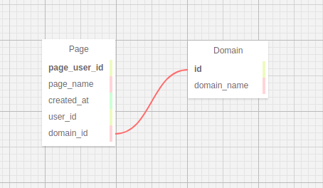

# Big Data Project(Topic3 - Wiki)

# Структура бази даних



# Файл змінних середовища
Для більшого захисту паролб і інші дані про базу даних,
яка розгорнута на клауді були винесені в ``.env`` файл.
Його потрібно створити в кореневій папці.
Його структура:
```
   export DB_HOST = ''
   export DB_NAME = ''
   export DB_USER = ''
   export DB_PASSWORD = ''
   export DB_PORT = ''
```