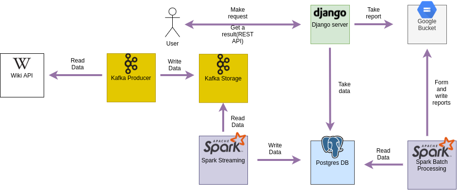
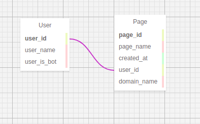
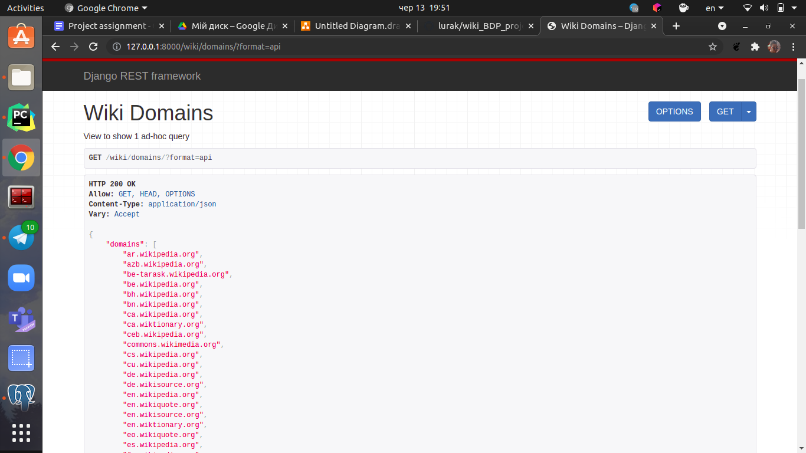
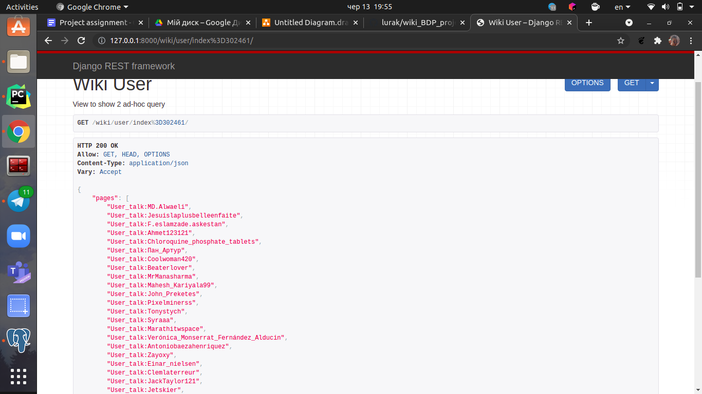
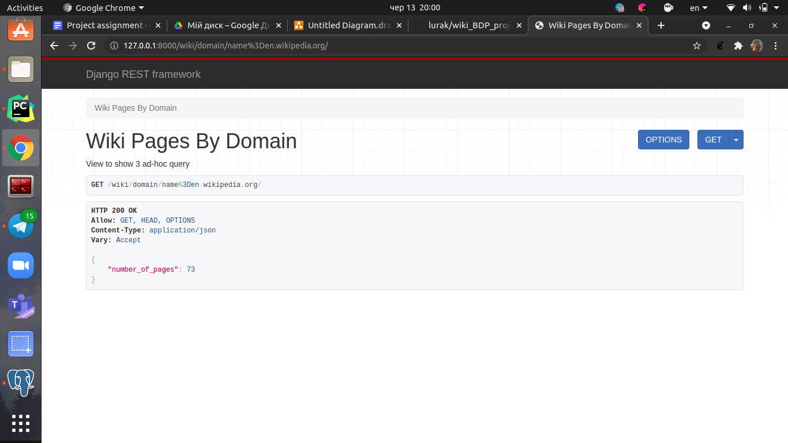
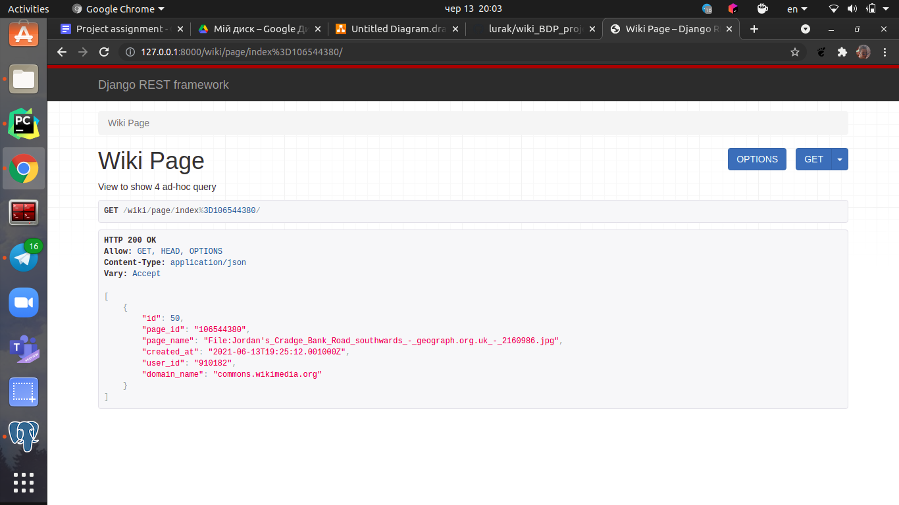
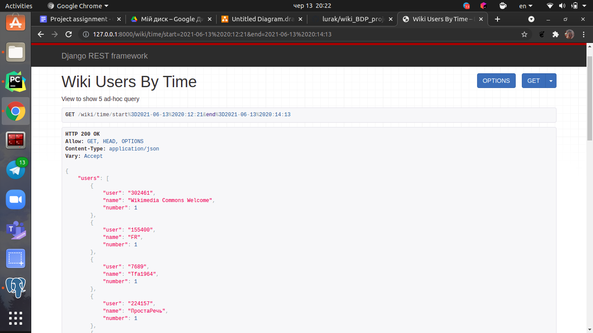
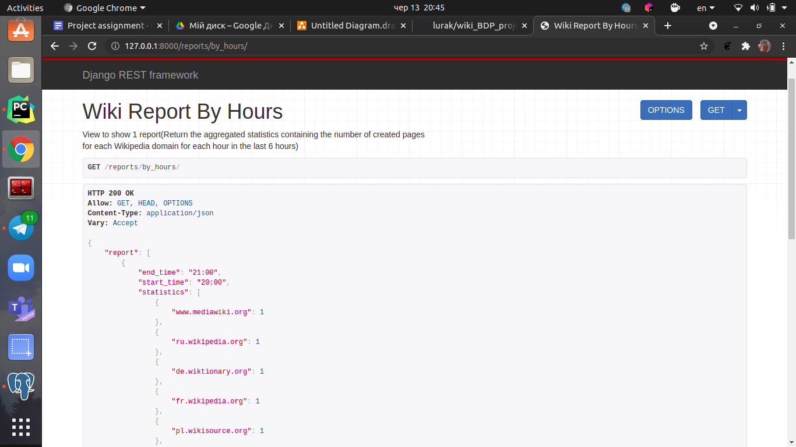
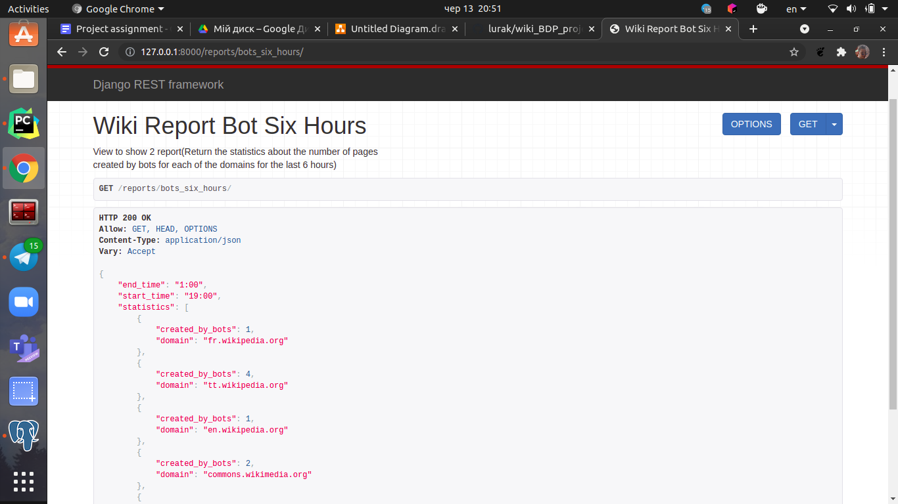
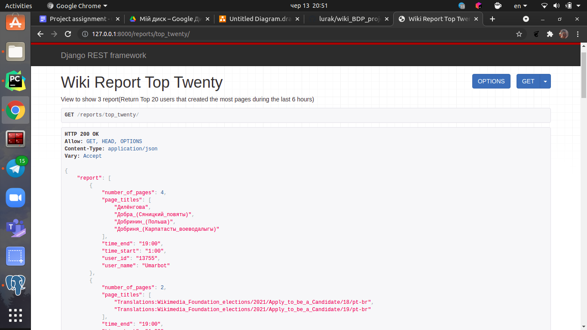

# Big Data Project(Topic3 - Wiki)
# Виконали Тітов Ігор і Шахов Михайло
# Архітектура проєкту



1) За допомогою Kafka Producer ми зчитуємо дані з Wiki
2) Kafka Producer пише ці дані в Kafka
3) За допомогою Spark Streaming опрацьовуєм ці дані і пише
   в базу даних
4) Spark Bath Processing вичитує дані з бази даних за
   період часу(6 годин) і формує звіти, які потім записує
   в Google Bucket
5) Django server робить запити в базу даних для того, щоб сформувати корисутвачу
ad-hoc queries і віддає їх користувачу
6) Django server зчитує звіти з Google Bucket і віддає користувачу   


# Структура бази даних



Так як потрібних даних для роботи програми не є багато і
до того ж їхня структура не є складною і ми завжди знаєм, які
дані нам приходять, адже вони є однорідними ми вирішили
використовувати Postgres.

Репорти ми вирішили зберігати в Google Storage, адже нам
потрібно діставати весь вміст файлу. Також це просто зручніше.

# REST API
## Ad-hoc Queries
### 1 Query

Перша ad-hoc query, яка повертає список всіх доменів,
які існуюють.

URL:
```
 /wiki/domains/
```
### 2 Query

Друга ad-hoc query, яка повертає список всіх статей,
які написав конкретний юзер за його id.

URL:
```
 /wiki/user/index=<str:pk>/
```
Де `<str:pk>` - це юзер id
### 3 Query

Третя ad-hoc query, яка повертає кількість статтей,
які написані під конкретним доменом.

URL:
```
 /wiki/domain/name=<str:pk>/
```
Де `<str:pk>` - це ім'я домену
### 4 Query

Четверта ad-hoc query, яка повертає інформацію про статтю
за її id.

URL:
```
 /wiki/page/index=<str:pk>/
```
Де `<str:pk>` - це id сторінки
### 5 Query

П'ята ad-hoc query, яка повертає інформацію про юзерів,
які створили хоча б одну сторінку за даний проміжок часу.

URL:
```
 /wiki/time/start=<str:date_start>&end=<str:date_end>
```
Де `<str:date_start>` - це початок часового проміжку
   `<str:date_end>` - це кінець часового проміжку 


## Reports
### 1 Report

URL:
```
 /reports/by_hours/
```
### 2 Report

URL:
```
 /reports/bots_six_hours/
```
### 3 Report

URL:
```
 /reports/top_twenty/
```

# Файл змінних середовища
Для більшого захисту паролю і інші даних про базу даних,
яка розгорнута на клауді були винесені в ``.env`` файл.
Його потрібно створити в кореневій папці.
Його структура:
```
   export DB_HOST = ''
   export DB_NAME = ''
   export DB_USER = ''
   export DB_PASSWORD = ''
   export DB_PORT = ''
```

# Компоненти проекти
* data_reader.py - Продюсер, який зчитує дані з сайту та передає в кафку
--------------------------

```
$ python data_reader.py <host:port>


```

* batch_processing.py - Компонента для формування звітів, який використовує spark batch processing, Вимагає версію спарку Spark 3.1
--------------------------

```
$ spark-submit  --packages org.postgresql:postgresql:42.2.10 batch_processing.py <date> <repots-folder>


<date> - дата, коли формувати звіт, у наступному форматі 2021-06-13/23:32:59
<repots-folder> - директорія, куди записувати звіти 

```
* spark_processing.py - Компонента, яка зчитує дані з кафки, обробляє їх та пушить в базу даних за допомогою спарк срімінга, вимагає версію спарку Spark 2.4.8 та 
пайтону Python3.7
```
spark-submit --packages org.apache.spark:spark-streaming-kafka-0-8_2.11:2.4.8 spark_processing.py <host:port>

<host:port> - хост порт кафки
```
* в директорії wiki_api знаходиться django аплікація
